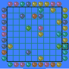
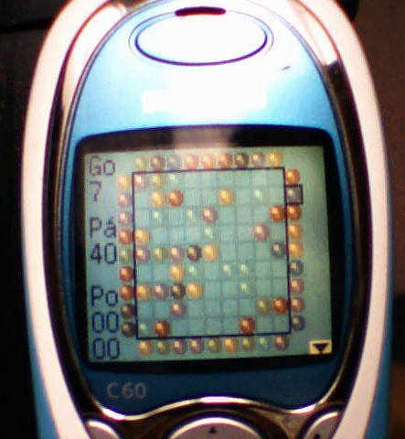
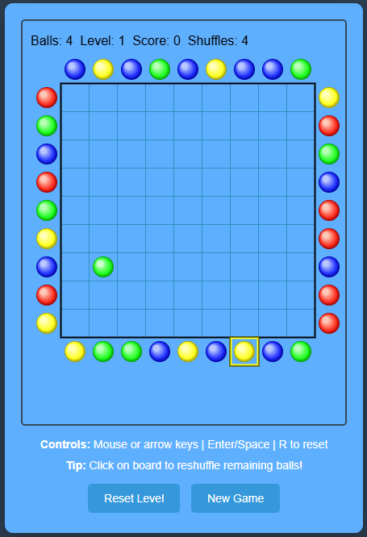

# Gluglu

A single file HTML5 logic game ported from the J2ME sources from 2004.

## Origin

This was my first J2ME game written in 2004 in Java 1.2 (which later was rebranded as Java 2.0). I've shown the Java source file to Claude Code AI and asked to port it to HTML5, which it did mostly successfully in two tries. I still had to add some minor fixes here and there.

The original game was created for the Siemens C60 and then later it was tested on various Nokia brickphones. I found some kind people on the net to translate the game to various languages like Hungarian, English, German and Finnish. In the settings, the player could choose the difficulty (how many different marble colors to use, and what level it should start), also it supported black and white devices and color blind folks by offering shapes instead of colored marbles. The game also figured out the resolution and adapted the graphics to that.

## Differences

There are many differences because Claude Code AI dropped most of the accessibility features while porting the game:

* No settings at all, always starting with 4 colors and in Level 1, difficulty goes up from level to level then adding a new color after beating level 50.
* No localization anymore, it's English only now.
* No help screen, but you get some basic information on screen.
* It kept the original control which I originally designed for the 3x4 keypad control cell phones had that time, however AI added mouse control (will add touch control later on).
* Clicking the center of the board does a reshuffle, it's a new feature, making the game more accessible I hope.
* AI made it that the difficulty, level and score information saved to the LocalStorage, saving your progress.
* No more adaptive screen resolution, AI seems to have ported it with fixed parameters.

## Additional notes
Created the game after reading a book about Java programming in 2004 while I still visited Uni learning totally unrelated Civil Engineering stuff. Original code and the ported code also using weird English-Hungarian variable names, I'm leaving them as is.

## Try it out
https://bencepapa.github.io/Gluglu/
